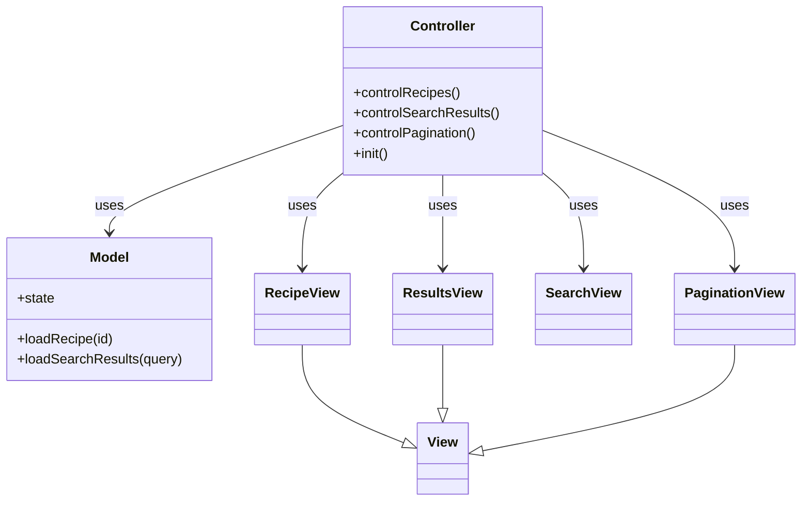
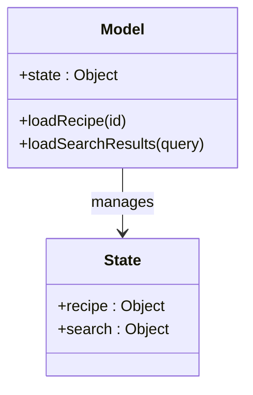
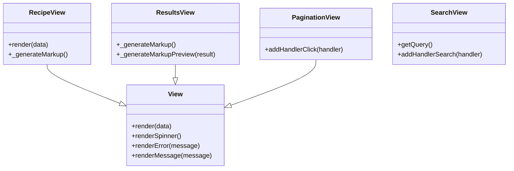
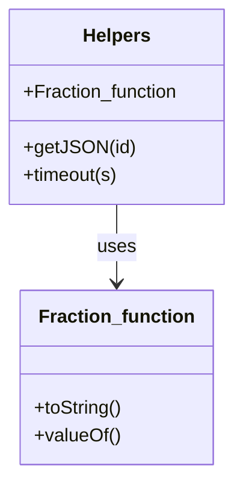
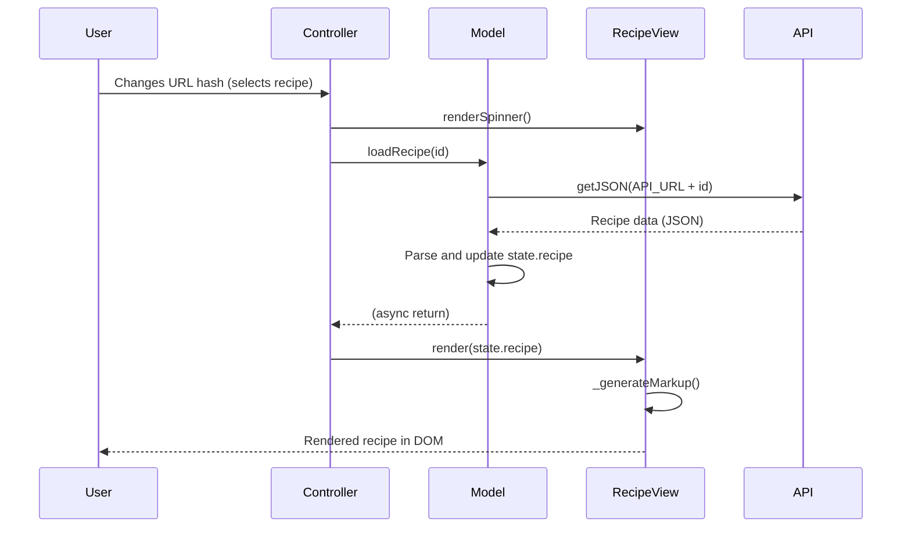
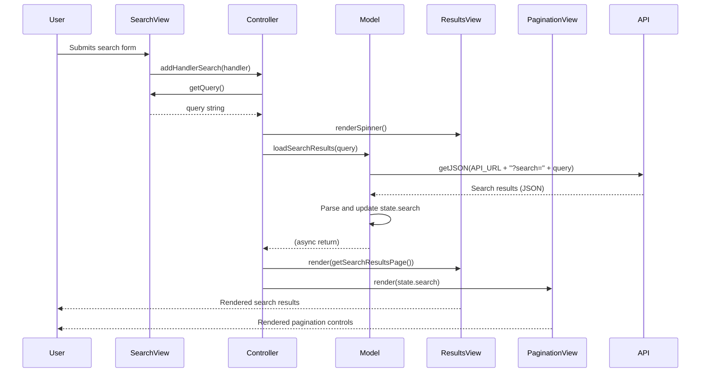
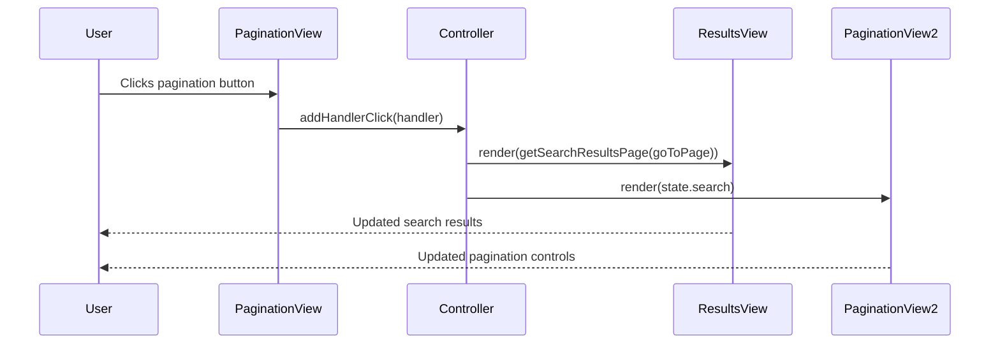

# Forkify Project UML Diagrams

## 1. High-Level Architecture (MVC Pattern)

---

## 2. Model Structure

---

## 3. View Inheritance

---

## 4. Helpers and Utilities

---

## 5. Sequence Diagram: Recipe Loading Flow

---

## 6. Sequence Diagram: Search Recipes Flow

---

## 7. Sequence Diagram: Pagination Flow

